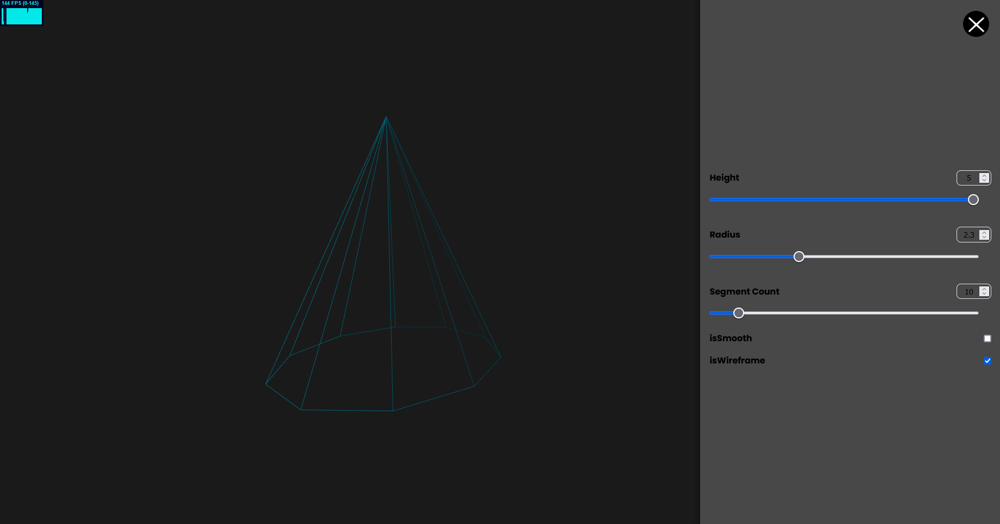

# 3d-cone

## Preview


## Features:
  - Three.js for geometry vizualize
  - Frontend on React with react-router-dom and MobX
  - Backend on Nest.js

## Install Dependencies From Fronted
```
  git clone https://github.com/Ermak102/3d-cone.git
  cd cone
  npm i
```
## Install Dependencies From Backend
```
  cd backend
  npm i
```
## Run Frontend
```
  npm start

```
## Run Backend
```
  npm run start

```
